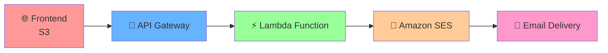

# 🚀✨ AWS Lambda Serverless Contact Form Guide ✨🚀

<div align="center">


</div>

## 🎬 Complete Tutorial: Building a Serverless Contact Form 🎬

<div align="center">

### 🌟 **Transform Your Static Website into a Dynamic Powerhouse!** 🌟

</div>

### 📋 Table of Contents
1. [🎯 Overview](#-overview)
2. [🏗️ Architecture](#️-architecture)
3. [📋 Prerequisites](#-prerequisites)
4. [🚀 Step-by-Step Implementation](#-step-by-step-implementation)
5. [🧪 Testing](#-testing)
6. [🔧 Troubleshooting](#-troubleshooting)
7. [🏆 Best Practices](#-best-practices)
8. [💰 Cost Optimization](#-cost-optimization)

---

## 🎯 Overview

<div align="center">

### 🎆 **Welcome to the Future of Web Forms!** 🎆

</div>

This guide walks you through building a **serverless contact form** that:

<table>
<tr>
<td align="center">

💻 **No Servers**<br/>
Zero server management

</td>
<td align="center">

🚀 **Auto-Scale**<br/>
Handles any traffic

</td>
<td align="center">

💰 **Pay-per-Use**<br/>
Only pay when used

</td>
<td align="center">

📧 **Email Magic**<br/>
Instant notifications

</td>
</tr>
</table>

---

<div align="center">

### 🏗️ **What You'll Build** 🏗️

</div>

| Component | Service | Purpose |
|-----------|---------|----------|
| 🌐 **Frontend** | S3 Static Hosting | Beautiful contact form |
| 🔗 **API** | API Gateway | REST endpoint |
| ⚡ **Backend** | Lambda Function | Form processing |
| 📧 **Email** | Amazon SES | Email delivery |

---

## 🏗️ Architecture

<div align="center">

### 🌌 **The Magic Flow** 🌌

</div>



---

<div align="center">

### 🎯 **AWS Services Lineup** 🎯

</div>

<table>
<tr>
<td align="center">

⚡ **AWS Lambda**<br/>
💻 Serverless compute<br/>
🚀 Auto-scaling magic

</td>
<td align="center">

🔗 **API Gateway**<br/>
🌐 REST API endpoint<br/>
🔒 Secure & managed

</td>
<td align="center">

📧 **Amazon SES**<br/>
📨 Email delivery<br/>
📊 High deliverability

</td>
</tr>
<tr>
<td align="center">

🌐 **Amazon S3**<br/>
📱 Static hosting<br/>
💰 Ultra-cheap storage

</td>
<td align="center">

📈 **CloudWatch**<br/>
🔍 Monitoring & logs<br/>
🚨 Real-time alerts

</td>
<td align="center">

🔒 **IAM**<br/>
🔐 Security & permissions<br/>
🛡️ Access control

</td>
</tr>
</table>

---

## 📋 Prerequisites

<div align="center">

### 🎆 **Get Ready for Liftoff!** 🎆

</div>

<table>
<tr>
<td align="center" width="50%">

### 🚀 **What You Need**

✅ AWS Account (Free tier works!)<br/>
✅ AWS CLI installed<br/>
✅ Basic JavaScript knowledge<br/>
✅ Text editor of choice<br/>
✅ Coffee ☕ (optional but recommended)

</td>
<td align="center" width="50%">

### 🔒 **IAM Permissions Required**

⚡ Lambda (create & manage)<br/>
🔗 API Gateway (setup & deploy)<br/>
📧 SES (send emails)<br/>
🌐 S3 (bucket & hosting)<br/>
📈 CloudWatch (logs & monitoring)

</td>
</tr>
</table>

---

<div align="center">

### 🏁 **Skill Level: Beginner to Intermediate** 🏁


</div>

---

## 🚀 Step-by-Step Implementation

<div align="center">

### 🎆 **Let's Build Something Amazing!** 🎆

</div>

---

## 📧 Step 1: Set up Amazon SES

<div align="center">

### 🌟 **Email Magic Setup** 🌟


</div>

## 🌐 Live Demo
**Try the Contact Form:** https://5gjqbtzkzdczmpiyisw6v2wpq40fofwh.lambda-url.ap-south-1.on.aws/?page=home

Experience the serverless contact form in action! This demo showcases the complete integration of Lambda, API Gateway, SES, and S3.

#### 🔄 Email Verification Process

```
💻 AWS Console → 📧 Amazon SES → ✅ Verified Identities → 🎆 Create Identity
```

<table>
<tr>
<td align="center" width="33%">

**📝 Step 1**<br/>
Navigate to SES Console

</td>
<td align="center" width="33%">

**✅ Step 2**<br/>
Add your email address

</td>
<td align="center" width="33%">

**📨 Step 3**<br/>
Confirm via email link

</td>
</tr>
</table>

#### 🚨 Key Considerations

> 📝 **Sandbox Mode**: SES starts in sandbox - only verified emails work<br/>
> 🌐 **Production Access**: Request to send to any email<br/>
> 🗺️ **Regional Service**: Choose your preferred AWS region

---

### Step 2: Create Lambda Function

#### Function Setup
1. Create new Lambda function from scratch
2. Choose Node.js runtime (latest version)
3. Configure basic execution role

#### Core Logic Implementation
Your Lambda function should handle:
- **CORS Headers**: Enable cross-origin requests from your website
- **Input Validation**: Verify required fields (name, email, message)
- **Email Formatting**: Structure HTML and text versions
- **SES Integration**: Send email using AWS SDK
- **Error Handling**: Return appropriate HTTP status codes
- **Response Format**: JSON responses for frontend consumption

#### Function Structure
```
Handler Function:
├── CORS Configuration
├── HTTP Method Validation (POST/OPTIONS)
├── Request Body Parsing
├── Input Validation
├── Email Parameter Setup
├── SES Email Sending
└── Response Formatting
```

---

### Step 3: Configure Lambda Permissions

#### IAM Role Requirements
Your Lambda execution role needs:
- **SES Permissions**: Send email capabilities
- **CloudWatch Logs**: Function monitoring and debugging
- **Basic Lambda Execution**: Standard runtime permissions

#### Security Best Practices
- Use least privilege principle
- Restrict SES permissions to specific actions
- Enable CloudWatch logging for troubleshooting

---

### Step 4: Create API Gateway

#### REST API Setup
1. Create new REST API
2. Configure regional endpoint type
3. Create resource path for contact endpoint

#### Method Configuration
- **POST Method**: Handle form submissions
- **OPTIONS Method**: Handle CORS preflight requests
- **Lambda Integration**: Connect to your function
- **Request/Response Mapping**: Configure data flow

#### CORS Configuration
Enable cross-origin requests with:
- Allowed origins (your S3 website)
- Allowed headers (Content-Type)
- Allowed methods (POST, OPTIONS)

#### Deployment
- Create deployment stage (e.g., 'prod')
- Note the invoke URL for frontend integration

---

### Step 5: Create Frontend HTML

#### Form Structure
Design a contact form with:
- **Input Fields**: Name, email, message
- **Validation**: Client-side and server-side
- **Styling**: Professional appearance
- **Responsive Design**: Mobile-friendly layout

#### JavaScript Logic
Implement form handling:
- **Form Submission**: Prevent default browser behavior
- **Data Collection**: Gather form field values
- **API Communication**: Send POST request to API Gateway
- **Response Handling**: Display success/error messages
- **User Feedback**: Loading states and confirmation

#### Key Features
- Input validation before submission
- Loading indicators during processing
- Success/error message display
- Form reset after successful submission
- Proper error handling and user feedback

---

### Step 6: Deploy to S3

#### Bucket Configuration
1. Create S3 bucket with unique name
2. Enable static website hosting
3. Set index document (index.html)
4. Configure public read access

#### Security Setup
- Create bucket policy for public read access
- Ensure proper CORS configuration
- Consider CloudFront for enhanced security

#### File Upload
- Upload HTML file to bucket root
- Update API Gateway URL in JavaScript
- Test website accessibility

---

## 🧪 Testing

### Testing Strategy
1. **Unit Testing**: Test Lambda function with sample events
2. **API Testing**: Use tools like Postman or curl
3. **Integration Testing**: Test complete form submission flow
4. **User Testing**: Verify email delivery and user experience

### Common Test Cases
- Valid form submission
- Missing required fields
- Invalid email format
- Large message content
- Network connectivity issues

---

## 🔧 Troubleshooting

### Common Issues and Solutions

#### CORS Errors
- Verify API Gateway CORS configuration
- Check Lambda function CORS headers
- Ensure preflight OPTIONS handling

#### Email Delivery Issues
- Confirm SES email verification
- Check sandbox mode limitations
- Verify IAM permissions for SES

#### Lambda Function Errors
- Review CloudWatch logs
- Check function timeout settings
- Verify IAM role permissions

#### API Gateway Problems
- Validate request/response mapping
- Check deployment status
- Verify integration configuration

---

## 🏆 Best Practices

### Security
- Implement input sanitization
- Use specific CORS origins (not wildcard)
- Add rate limiting to prevent abuse
- Consider AWS WAF for additional protection

### Performance
- Optimize Lambda function memory allocation
- Minimize cold start impact
- Use connection pooling for external services
- Implement proper error handling

### Monitoring
- Set up CloudWatch alarms
- Monitor Lambda metrics (duration, errors, throttles)
- Track API Gateway request patterns
- Log important events for debugging

### Code Quality
- Implement comprehensive input validation
- Use proper error handling patterns
- Follow AWS SDK best practices
- Maintain clean, readable code structure

---

## 💰 Cost Optimization

### Service Pricing Overview

#### AWS Lambda
- **Free Tier**: 1M requests/month + 400,000 GB-seconds
- **Pay-per-use**: Only charged for actual execution time

#### API Gateway
- **REST API**: $3.50 per million requests
- **HTTP API**: $1.00 per million requests (consider for cost savings)

#### Amazon SES
- **Free Tier**: 62,000 emails/month (when sending from EC2)
- **Standard Pricing**: $0.10 per 1,000 emails

#### Amazon S3
- **Free Tier**: 5GB storage + 20,000 GET requests
- **Minimal Cost**: Static website hosting is very affordable

### Cost Example (1,000 monthly submissions)
- Lambda: $0.00 (within free tier)
- API Gateway: $0.004
- SES: $0.10
- S3: $0.00 (within free tier)
- **Total**: ~$0.10/month

---

## 📞 Support and Resources

### 🤝 Getting Help
- 📧 **Contact us**: awscloudclubscoe@yahoo.com
- 📚 **AWS Documentation**: [Official AWS Docs](https://docs.aws.amazon.com/)
- 🎧 **AWS Support**: [AWS Support Center](https://console.aws.amazon.com/support/)
- 💬 **Community**: [AWS re:Post](https://repost.aws/)

---

### 📚 **Official AWS Documentation**

<table>
<tr>
<td align="center" width="50%">

⚡ **AWS Lambda**<br/>
📖 [Developer Guide](https://docs.aws.amazon.com/lambda/latest/dg/welcome.html)<br/>
🔧 [API Reference](https://docs.aws.amazon.com/lambda/latest/api/)<br/>
🎯 [Best Practices](https://docs.aws.amazon.com/lambda/latest/dg/best-practices.html)

</td>
<td align="center" width="50%">

📧 **Amazon SES**<br/>
📖 [Developer Guide](https://docs.aws.amazon.com/ses/latest/dg/Welcome.html)<br/>
📨 [Sending Guidelines](https://docs.aws.amazon.com/ses/latest/dg/sending-email.html)<br/>
🔒 [Security Best Practices](https://docs.aws.amazon.com/ses/latest/dg/security.html)

</td>
</tr>
<tr>
<td align="center" width="50%">

🔗 **API Gateway**<br/>
📖 [Developer Guide](https://docs.aws.amazon.com/apigateway/latest/developerguide/welcome.html)<br/>
🚀 [REST API Guide](https://docs.aws.amazon.com/apigateway/latest/developerguide/apigateway-rest-api.html)<br/>
🔧 [Troubleshooting](https://docs.aws.amazon.com/apigateway/latest/developerguide/api-gateway-troubleshooting.html)

</td>
<td align="center" width="50%">

🌐 **Amazon S3**<br/>
📖 [User Guide](https://docs.aws.amazon.com/s3/latest/userguide/Welcome.html)<br/>
🏠 [Static Website Hosting](https://docs.aws.amazon.com/s3/latest/userguide/WebsiteHosting.html)<br/>
🔒 [Security Guide](https://docs.aws.amazon.com/s3/latest/userguide/security.html)

</td>
</tr>
</table>

---

### 🎓 **Additional Learning Resources**

- 🎬 **AWS Training**: [AWS Skill Builder](https://skillbuilder.aws/)
- 📺 **YouTube**: [AWS Official Channel](https://www.youtube.com/user/AmazonWebServices)
- 🏗️ **Architecture**: [AWS Architecture Center](https://aws.amazon.com/architecture/)
- 📊 **Pricing**: [AWS Pricing Calculator](https://calculator.aws/)
- 🔧 **Tools**: [AWS CLI Documentation](https://docs.aws.amazon.com/cli/)
- 🎯 **[EC2 Guide](https://github.com/THE-S0HAM/Learn-AWS-with-Cloud-Clubs/tree/main/EC2)**
- 🚀 **[AWS Samples](https://github.com/aws-samples)**
- 💡 **[AWS Workshops](https://workshops.aws/)**

---
