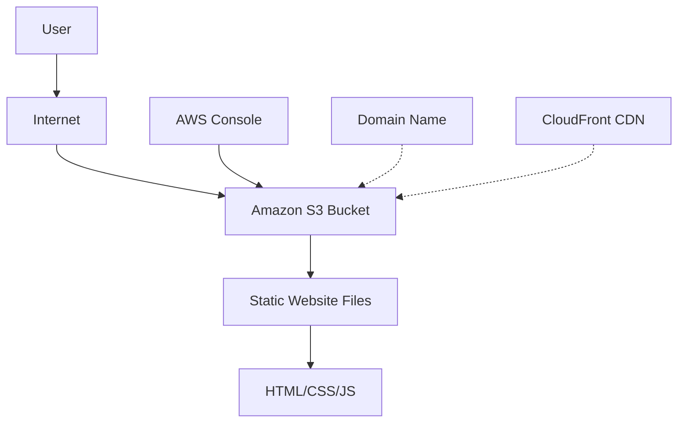

# 🌐 AWS S3 Static Website Hosting Guide

<div align="center">


**A comprehensive guide for hosting static websites using Amazon S3**

[🚀 Live Demo](http://static-website-hosting-using-s3-tutorial-guide.s3-website.ap-south-1.amazonaws.com/index.html)

</div>

---

## 📋 Table of Contents

- [🎯 Project Overview](#-project-overview)
- [✨ Features](#-features)
- [🏗️ Architecture](#️-architecture)
- [🛠️ Setup Guide](#️-setup-guide)
- [📁 Project Structure](#-project-structure)
- [🔧 Configuration](#-configuration)
- [💡 Best Practices](#-best-practices)
- [💰 Cost Optimization](#-cost-optimization)
- [🔒 Security](#-security)
- [🚀 Live Demo](http://static-website-hosting-using-s3-tutorial-guide.s3-website.ap-south-1.amazonaws.com/index.html)
- [👥 Contributors](#-contributors)
- [📄 License](#-license)

---

## 🎯 Project Overview

This project demonstrates how to host a static website using **Amazon S3** (Simple Storage Service). It's designed as an educational resource for AWS learners, providing a complete guide with practical examples and best practices.

### 🎓 Learning Objectives

- Understand Amazon S3 fundamentals
- Learn static website hosting concepts
- Master S3 bucket configuration
- Implement security best practices
- Optimize costs and performance

---

## ✨ Features

### 🌟 Website Features
- **Responsive Design** - Mobile-friendly interface
- **Modern UI/UX** - Clean and professional design
- **Interactive Navigation** - Smooth user experience
- **Educational Content** - Comprehensive AWS S3 documentation
- **Contact Information** - Easy way to connect with contributors

### ⚡ Technical Features
- **Static Website Hosting** - Powered by Amazon S3
- **Custom Domain Support** - Ready for custom domain setup
- **SEO Optimized** - Meta tags and structured content
- **Fast Loading** - Optimized assets and CDN-ready
- **Cross-browser Compatible** - Works on all modern browsers

---

## 🏗️ Architecture



### 🔄 Data Flow
1. User requests website URL
2. Request routed to S3 bucket endpoint
3. S3 serves static files (HTML, CSS, JS, images)
4. Browser renders the website

---

## 🛠️ Setup Guide

### 📋 Prerequisites

- AWS Account (Free tier eligible)
- Basic knowledge of HTML/CSS
- Web browser
- Text editor (optional)

### 🚀 Step-by-Step Instructions

#### 1️⃣ Create AWS Account
```bash
# Visit: https://aws.amazon.com/
# Click "Create an AWS Account"
# Follow the registration process
```

#### 2️⃣ Access S3 Console


1. Sign in to AWS Management Console
2. Search for "S3" in services
3. Click on "S3" to open the console

#### 3️⃣ Create S3 Bucket

```json
{
  "BucketName": "your-unique-bucket-name",
  "Region": "us-east-1",
  "PublicAccess": "Enabled",
  "Versioning": "Disabled",
  "Tags": [
    {
      "Key": "Project",
      "Value": "AWS-Learners-Guide"
    },
    {
      "Key": "Purpose", 
      "Value": "Static-Website-Hosting"
    },
    {
      "Key": "Environment",
      "Value": "Education"
    }
  ]
}
```

**Detailed Steps:**
1. Click **"Create bucket"**
2. Enter a globally unique bucket name
3. Choose your preferred AWS region
4. **Uncheck "Block all public access"**
5. Acknowledge the warning about public access
6. Add recommended tags (see above)
7. Click **"Create bucket"**

#### 4️⃣ Upload Website Files


```bash
# Example website structure:
├── index.html          # Main homepage
├── about.html          # About page (optional)
├── contact.html        # Contact page (optional)
├── error.html          # Custom error page (optional)
├── css/
│   └── styles.css     # Main stylesheet
├── js/
│   └── script.js      # JavaScript files
├── images/
│   ├── logo.png       # Website logo
│   └── banner.jpg     # Hero image
└── assets/
    └── favicon.ico    # Website favicon
```

1. Select your bucket
2. Click **"Upload"**
3. Drag and drop all project files
4. Maintain folder structure
5. Click **"Upload"**

#### 5️⃣ Enable Static Website Hosting


1. Go to bucket **Properties** tab
2. Scroll to **"Static website hosting"**
3. Click **"Edit"**
4. Select **"Enable"**
5. Set **Index document**: `index.html`
6. Set **Error document**: `error.html` (optional)
7. Click **"Save changes"**

#### 6️⃣ Configure Bucket Policy

```json
{
  "Version": "2012-10-17",
  "Statement": [
    {
      "Sid": "PublicReadGetObject",
      "Effect": "Allow",
      "Principal": "*",
      "Action": "s3:GetObject",
      "Resource": "arn:aws:s3:::your-bucket-name/*"
    }
  ]
}
```

**Apply the Policy:**
1. Go to **Permissions** tab
2. Scroll to **"Bucket policy"**
3. Click **"Edit"**
4. Paste the above JSON (replace `your-bucket-name`)
5. Click **"Save changes"**

#### 7️⃣ Access Your Website


Your website URL format:
```
http://your-bucket-name.s3-website-region.amazonaws.com
```

Example:
```
http://aws-learners-guide.s3-website-us-east-1.amazonaws.com
```

---

## 📁 Project Structure

```
my-static-website/
│
├── 📄 README.md                 # Project documentation
├── 📄 LICENSE                   # Project license
├── 🏠 index.html               # Main homepage
├── 📄 about.html               # About page (optional)
├── 📞 contact.html             # Contact page (optional)
├── ❌ error.html               # Custom 404 error page
│
├── 🎨 css/
│   ├── styles.css              # Main stylesheet
│   └── responsive.css          # Mobile responsive styles
│
├── ⚡ js/
│   ├── main.js                 # Main JavaScript file
│   └── utils.js                # Utility functions
│
├── 🖼️ images/
│   ├── logo.png                # Website logo
│   ├── hero-banner.jpg         # Hero section image
│   └── gallery/                # Image gallery folder
│       ├── image1.jpg
│       └── image2.jpg
│
└── 📁 assets/
    ├── favicon.ico             # Website favicon
    ├── fonts/                  # Custom fonts
    └── documents/              # PDF files, etc.
        └── brochure.pdf
```

---

## 🔧 Configuration

### 🏷️ Recommended S3 Bucket Tags

| Key | Value | Purpose |
|-----|-------|---------|
| `Project` | `AWS-Learners-Guide` | Project identification |
| `Purpose` | `Static-Website-Hosting` | Use case clarification |
| `Environment` | `Education` | Environment type |
| `Owner` | `AWS-Cloud-Club` | Ownership tracking |
| `Content-Type` | `Tutorial` | Content classification |
| `Cost-Center` | `Learning-Resources` | Cost allocation |

### 🌐 Custom Domain Setup (Optional)

```bash
# 1. Register domain with Route 53 or external registrar
# 2. Create CNAME record pointing to S3 endpoint
# 3. Update bucket name to match domain
# 4. Configure SSL with CloudFront (recommended)
```

---

## 💡 Best Practices

### 🔒 Security Best Practices

#### ✅ Do's
- Use least privilege access policies
- Enable S3 access logging
- Implement proper CORS configuration
- Use HTTPS with CloudFront
- Regular security audits

#### ❌ Don'ts
- Don't store sensitive data in public buckets
- Don't use overly permissive bucket policies
- Don't ignore AWS security recommendations
- Don't forget to monitor access patterns

### ⚡ Performance Optimization

```javascript
// Optimize images before upload
const optimizationTips = {
  images: {
    format: "WebP or JPEG",
    compression: "80-90%",
    sizing: "Responsive images"
  },
  css: {
    minification: "Remove whitespace",
    combining: "Merge CSS files"
  },
  javascript: {
    minification: "Uglify/Terser",
    bundling: "Webpack/Rollup"
  }
};
```

### 📊 Monitoring and Analytics

```yaml
CloudWatch Metrics:
  - BucketSizeBytes
  - NumberOfObjects
  - BucketRequests
  - DataTransfer

S3 Access Logs:
  - Enable server access logging
  - Monitor request patterns
  - Identify optimization opportunities
```

---

## 💰 Cost Optimization

### 💵 Pricing Breakdown

| Component | Cost Factor | Optimization |
|-----------|-------------|--------------|
| **Storage** | $0.023/GB/month | Use appropriate storage class |
| **Requests** | $0.0004/1000 GET | Implement caching |
| **Data Transfer** | $0.09/GB | Use CloudFront CDN |

### 🎯 Cost Saving Tips

1. **Use S3 Intelligent Tiering** for automatic cost optimization
2. **Enable CloudFront** to reduce data transfer costs
3. **Compress files** before uploading
4. **Monitor usage** with AWS Cost Explorer
5. **Set up billing alerts** to avoid surprises

### 📈 Free Tier Benefits

```
AWS Free Tier (First 12 months):
├── 5 GB S3 Standard storage
├── 20,000 GET requests
├── 2,000 PUT requests
└── 15 GB data transfer out
```

---

## 🔒 Security

### 🛡️ Security Checklist

- [ ] Bucket policy configured correctly
- [ ] Public access settings reviewed
- [ ] Access logging enabled
- [ ] Versioning enabled (if needed)
- [ ] MFA delete enabled (for production)
- [ ] Cross-region replication (for critical data)

### 🔐 Access Control

```json
{
  "Version": "2012-10-17",
  "Statement": [
    {
      "Effect": "Allow",
      "Principal": "*",
      "Action": "s3:GetObject",
      "Resource": "arn:aws:s3:::your-bucket/*",
      "Condition": {
        "StringEquals": {
          "s3:ExistingObjectTag/Environment": "Education"
        }
      }
    }
  ]
}
```

---

## 🚀 Live Demo

### 🌐 Example Website Sections

| Page | Description | Purpose |
|------|-------------|----------|
| **Home** | Main landing page | Welcome visitors, showcase content |
| **About** | Company/personal info | Build trust, share story |
| **Services** | What you offer | Highlight capabilities |
| **Portfolio** | Work examples | Demonstrate expertise |

### 📱 Responsive Design

The website is fully responsive and works on:
- 🖥️ Desktop computers
- 💻 Laptops
- 📱 Mobile phones
- 📟 Tablets

---

## 👥 Contributors

<div align="center">

### 🌟 Project Contributors

</div>

<table>
<tr>
<td align="center">
<br/>
<b>Bhoomi Raut</b><br/>
<i>Cloud Tech Speaker & Former AWS Cloud Club Captain</i><br/>
<a href="https://www.linkedin.com/in/bhoomi-ganesh-raut">LinkedIn</a> • 
<a href="https://github.com/bhoomiraut07">GitHub</a><br/>
📧 bhoomi.raut07@gmail.com
</td>
<td align="center">
<br/>
<b>Soham Deshmukh</b><br/>
<i>AWS Cloud Club Captain</i><br/>
<a href="https://www.linkedin.com/in/soham--deshmukh">LinkedIn</a> • 
<a href="https://github.com/THE-S0HAM/Alpha-Capsule-Course">GitHub</a><br/>
📧 awscloudclubscoe@yahoo.com
</td>
</tr>
</table>

### 🏫 Organization

**AWS Cloud Club at Sanjivani College of Engineering**
- 📍 Kopargaon, Maharashtra, India
- 🎯 Motto: "Stay Connected, Grow Together"
- 🌐 Empowering students with cloud computing knowledge

---

## 🤝 Contributing

We welcome contributions! Here's how you can help:

1. **Fork** the repository
2. **Create** a feature branch (`git checkout -b feature/AmazingFeature`)
3. **Commit** your changes (`git commit -m 'Add some AmazingFeature'`)
4. **Push** to the branch (`git push origin feature/AmazingFeature`)
5. **Open** a Pull Request

### 📝 Contribution Guidelines

- Follow existing code style
- Add comments for complex logic
- Update documentation as needed
- Test your changes thoroughly

---

## 📚 Additional Resources

### 📖 AWS Documentation
- [Amazon S3 User Guide](https://docs.aws.amazon.com/s3/)
- [Static Website Hosting](https://docs.aws.amazon.com/AmazonS3/latest/userguide/WebsiteHosting.html)
- [S3 Pricing](https://aws.amazon.com/s3/pricing/)

### 🎓 Learning Materials
- [AWS Free Tier](https://aws.amazon.com/free/)
- [AWS Training and Certification](https://aws.amazon.com/training/)
- [AWS Well-Architected Framework](https://aws.amazon.com/architecture/well-architected/)

### 🛠️ Tools and Utilities
- [AWS CLI](https://aws.amazon.com/cli/)
- [AWS SDK](https://aws.amazon.com/tools/)
- [S3 Browser](https://s3browser.com/)

---

## 🐛 Troubleshooting

### Common Issues and Solutions

#### 🚫 403 Forbidden Error
```bash
# Check bucket policy and public access settings
# Ensure bucket policy allows s3:GetObject
# Verify files are uploaded correctly
```

#### 🔗 Website Not Loading
```bash
# Verify static website hosting is enabled
# Check index document name (case-sensitive)
# Confirm bucket policy is applied
```

#### 💸 Unexpected Charges
```bash
# Review AWS billing dashboard
# Check data transfer usage
# Consider implementing lifecycle policies
```

---

## 📄 License

This project is licensed under the **MIT License** - see the [LICENCE](https://github.com/THE-S0HAM/Learn-AWS-with-Cloud-Clubs/blob/main/LICENSE) file for details.

```
MIT License

Copyright (c) 2025 AWS Cloud Club - Sanjivani College of Engineering

Permission is hereby granted, free of charge, to any person obtaining a copy
of this software and associated documentation files (the "Software"), to deal
in the Software without restriction, including without limitation the rights
to use, copy, modify, merge, publish, distribute, sublicense, and/or sell
copies of the Software, and to permit persons to whom the Software is
furnished to do so, subject to the following conditions:

The above copyright notice and this permission notice shall be included in all
copies or substantial portions of the Software.
```

---

## 🙏 Acknowledgments

- **Amazon Web Services** for providing excellent cloud services
- **AWS Cloud Club At Sanjivani College of Engineering** for collaboration and support
- **AWS Cloud Club** community for collaboration and learning
- **Open source community** for inspiration and resources

---

<div align="center">

### 🌟 Star this repository if you found it helpful!

**Made with ❤️ by AWS Cloud Club**

[⬆️ Back to Top](#-aws-s3-static-website-hosting-guide)

</div>

---

## 📞 Support

Need help? Reach out to us:

- 📧 **Email**: awscloudclubscoe@yahoo.com
- 💬 **LinkedIn**: Connect with our contributors
- 🐛 **Issues**: Create an issue in this repository
- 📚 **Documentation**: Check our comprehensive guides

**Happy Learning! 🚀**